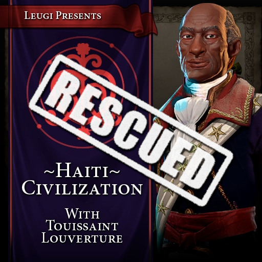

# Leugi's Haiti Civilization and Touissaint Louverture (GS version)
> An updated version of "Leugi's Haiti Civilization and Touissaint Louverture" mod.

**Reupload of the original mod by Leugi.**
This is an updated version of [Leugi's Haiti Civilization and Touissaint Louverture](https://steamcommunity.com/sharedfiles/filedetails/?id=1562787583) mod.
It adds the Haiti Civilization with Toussaint Louverture as its leader for Civilization VI - Gathering Storm (and later).

> If you like the **Haiti Civilization** mod: please support the original creators : Leugi & Captain Lime. **All credit to the original creators!**

For more detailed information about this mod please visit the Steam page of [the original mod](https://steamcommunity.com/sharedfiles/filedetails/?id=1562787583)!

**DO NOT USE TOGETHER WITH THE ORIGINAL MOD!**

---
### What has been updated?
- now compatible with GS and NFP
- needs both DLC R&F and GS
- StatusMessages have been moved to notifications (NOTIFICATION_USER_DEFINED_7)

### What has been tested?
- Mother of Liberty: burst of faith
- Mother of Liberty: policy card unlocking
- Abolition: era scores from removing builders
- Artisan of Abolition: pillaging a tile with a luxury resource grants a free builder

### What has NOT been tested?
- AI/computer playing haiti
- multiplayer

### Known problems
- the icons (and their sounds) for notifications of type USER_DEFINED_X are not consistent and can even change during the game!
- the ethnicity for the civilization is set to "ETHNICITY_AFRICAN" - just like in the original mod. Not sure why, but this is only working for the icons/avatars but not for the actual units on the ground. 

---
> If you like the **Haiti Civilization** mod: please support the original creators : Leugi & Captain Lime. **All credit to the original creators!**

If you want to appreciate the time and work I put into this update:
Feel free to buy me a cup of tea on Ko-fi to help me stay awake 😉.

> But again: please support the original creators : Leugi & Captain Lime. **All credit to the original creators!**
